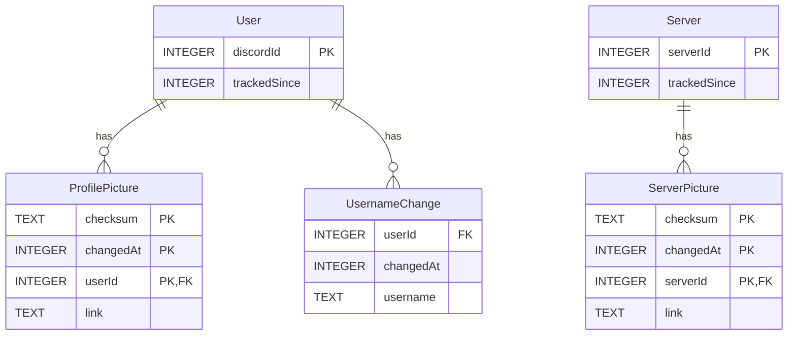

## Overview

PFP Checker uses SQLite as its embedded database, managed through SQLx with compile-time query verification. The schema tracks users, servers, profile pictures, server icons, and username changes with full historical records.

<Info>
  All migrations are located in the `migrations/` directory and are automatically applied on application startup.
</Info>

## Database Tables

### User Table

Tracks Discord users being monitored for profile picture and username changes.

**Migration:** `20240506183228_initial.sql`

```sql
CREATE TABLE User (
  discordId INTEGER,
  trackedSince INTEGER,
  PRIMARY KEY(discordId)
);
```

**Schema:**

| Column | Type | Description | Constraints |
|--------|------|-------------|-------------|
| `discordId` | INTEGER | Discord user ID (snowflake) | PRIMARY KEY |
| `trackedSince` | INTEGER | Unix timestamp when tracking started | |

**Usage:**
- Check if a user is being monitored
- Query all monitored users for updates
- Store when monitoring began

**Example Query:**
```sql
SELECT discordId FROM User;
```

### ProfilePicture Table

Stores historical profile picture data for tracked users.

**Migrations:**
- Initial: `20240506183228_initial.sql`
- Updated PK: `20241118130945_update_primary_key_of_profile_pictures.sql`

```sql
CREATE TABLE ProfilePicture (
  checksum TEXT,
  userId INTEGER,
  changedAt INTEGER,
  link TEXT,
  PRIMARY KEY(checksum, changedAt, userId),
  FOREIGN KEY(userId) REFERENCES User(discordId) ON DELETE CASCADE
);
```

**Schema:**

| Column | Type | Description | Constraints |
|--------|------|-------------|-------------|
| `checksum` | TEXT | SHA-1 hash of image data | Part of PRIMARY KEY |
| `userId` | INTEGER | Discord user ID | Part of PRIMARY KEY, FOREIGN KEY |
| `changedAt` | INTEGER | Unix timestamp of change | Part of PRIMARY KEY |
| `link` | TEXT | ImgBB URL to hosted image | |

**Key Design Decisions:**

- **Composite Primary Key**: `(checksum, changedAt, userId)` allows the same user to reuse a previous profile picture at different times
- **Cascade Deletion**: When a user is removed from monitoring, all their profile pictures are deleted automatically
- **Checksum-based Deduplication**: SHA-1 checksums prevent storing duplicate image URLs for identical images

**Usage:**
- Track profile picture history
- Calculate statistics (change frequency)
- Display historical images
- Detect when users revert to previous pictures

**Example Queries:**
```sql
-- Get all profile pictures for a user
SELECT * FROM ProfilePicture 
WHERE userId = ? 
ORDER BY changedAt DESC;

-- Count total changes
SELECT COUNT(*) FROM ProfilePicture WHERE userId = ?;

-- Check if image already exists
SELECT checksum FROM ProfilePicture 
WHERE checksum = ? AND userId = ?;
```

### UsernameChange Table

Records username/display name changes for tracked users.

**Migration:** `20240908172815_add_username_changes.sql`

```sql
CREATE TABLE UsernameChange (
  userId INTEGER,
  changedAt INTEGER,
  username TEXT,
  FOREIGN KEY(userId) REFERENCES User(discordId) ON DELETE CASCADE
);
```

**Schema:**

| Column | Type | Description | Constraints |
|--------|------|-------------|-------------|
| `userId` | INTEGER | Discord user ID | FOREIGN KEY |
| `changedAt` | INTEGER | Unix timestamp of change | |
| `username` | TEXT | Display name at this time | |

**Key Design Decisions:**

- **No Primary Key**: Allows tracking multiple records at the same timestamp if needed
- **Cascade Deletion**: Usernames are deleted when user monitoring stops
- **Nullable Columns**: SQLite allows NULL values for tracking flexibility

**Usage:**
- Display username history
- Track how often users change names
- Show usernames in chronological order

**Example Queries:**
```sql
-- Get username history
SELECT * FROM UsernameChange 
WHERE userId = ? 
ORDER BY changedAt DESC;

-- Check if username already recorded
SELECT username FROM UsernameChange 
WHERE username = ? AND userId = ?;
```

### Server Table

Tracks Discord servers (guilds) being monitored for icon changes.

**Migration:** `20251119225006_add_server_tracking.sql`

```sql
CREATE TABLE Server (
  serverId INTEGER,
  trackedSince INTEGER,
  PRIMARY KEY(serverId)
);
```

**Schema:**

| Column | Type | Description | Constraints |
|--------|------|-------------|-------------|
| `serverId` | INTEGER | Discord guild ID (snowflake) | PRIMARY KEY |
| `trackedSince` | INTEGER | Unix timestamp when tracking started | |

**Usage:**
- Check if a server is being monitored
- Query all monitored servers for updates
- Store when monitoring began

**Example Query:**
```sql
SELECT serverId FROM Server;
```

### ServerPicture Table

Stores historical server icon data for tracked servers.

**Migrations:**
- Table creation: `20251119225006_add_server_tracking.sql`
- Index optimization: `20251119233447_add_server_picture_index.sql`

```sql
CREATE TABLE ServerPicture (
  checksum TEXT,
  serverId INTEGER,
  changedAt INTEGER,
  link TEXT,
  PRIMARY KEY(checksum, changedAt, serverId),
  FOREIGN KEY(serverId) REFERENCES Server(serverId) ON DELETE CASCADE
);

CREATE INDEX IF NOT EXISTS idx_ServerPicture_serverId_changedAt
ON ServerPicture(serverId, changedAt DESC);
```

**Schema:**

| Column | Type | Description | Constraints |
|--------|------|-------------|-------------|
| `checksum` | TEXT | SHA-1 hash of icon image | Part of PRIMARY KEY |
| `serverId` | INTEGER | Discord guild ID | Part of PRIMARY KEY, FOREIGN KEY |
| `changedAt` | INTEGER | Unix timestamp of change | Part of PRIMARY KEY |
| `link` | TEXT | ImgBB URL to hosted icon | |

**Indexes:**
- `idx_ServerPicture_serverId_changedAt`: Optimizes queries by `serverId` with `ORDER BY changedAt DESC`

**Key Design Decisions:**

- **Mirrors ProfilePicture Design**: Same composite primary key pattern for consistency
- **Performance Index**: Dedicated index for common query pattern (history ordered by date)
- **Cascade Deletion**: Icons deleted when server monitoring stops

**Usage:**
- Track server icon history
- Calculate icon change statistics
- Display historical server icons
- Optimize queries with descending date order

**Example Queries:**
```sql
-- Get server icon history (uses index)
SELECT * FROM ServerPicture 
WHERE serverId = ? 
ORDER BY changedAt DESC;

-- Count total icon changes
SELECT COUNT(*) FROM ServerPicture WHERE serverId = ?;
```

## Entity Relationships



**Relationships:**

- **User → ProfilePicture**: One-to-Many with cascade delete
- **User → UsernameChange**: One-to-Many with cascade delete
- **Server → ServerPicture**: One-to-Many with cascade delete

<Note>
  All foreign keys use `ON DELETE CASCADE` to automatically clean up historical records when monitoring stops.
</Note>

## Migration System

PFP Checker uses SQLx's migration system for managing database schema changes.

### Migration Files

Migrations are stored in `migrations/` with timestamp-based naming:

```
migrations/
├── 20240506183228_initial.sql
├── 20240908172815_add_username_changes.sql
├── 20241118130945_update_primary_key_of_profile_pictures.sql
├── 20251119225006_add_server_tracking.sql
└── 20251119233447_add_server_picture_index.sql
```

**Naming Convention:**
- Format: `{timestamp}_{description}.sql`
- Timestamp: `YYYYMMDDHHMMSS`
- Description: Snake_case summary of changes

### Migration History

<Accordion title="20240506183228_initial.sql - Initial Schema">
  Creates the foundational tables:
  - `User` table for tracking monitored users
  - `ProfilePicture` table with initial primary key design
  
  **Original Primary Key:** `(checksum, userId)`
</Accordion>

<Accordion title="20240908172815_add_username_changes.sql - Username Tracking">
  Adds username/display name tracking:
  - `UsernameChange` table for historical username records
  - Foreign key relationship to User table
  - Cascade deletion for cleanup
</Accordion>

<Accordion title="20241118130945_update_primary_key_of_profile_pictures.sql - Enhanced PK">
  Updates ProfilePicture primary key to support reusing previous images:
  
  **New Primary Key:** `(checksum, changedAt, userId)`
  
  This migration:
  1. Creates new table with updated schema
  2. Copies all existing data
  3. Drops old table
  4. Renames new table to original name
  
  **Why:** Allows users to switch back to a previous profile picture, which is tracked as a new change at a different timestamp.
</Accordion>

<Accordion title="20251119225006_add_server_tracking.sql - Server Monitoring">
  Adds server/guild icon tracking:
  - `Server` table for monitored guilds
  - `ServerPicture` table mirroring ProfilePicture design
  - Composite primary key from the start: `(checksum, changedAt, serverId)`
</Accordion>

<Accordion title="20251119233447_add_server_picture_index.sql - Query Optimization">
  Adds performance index for common query pattern:
  
  ```sql
  CREATE INDEX idx_ServerPicture_serverId_changedAt
  ON ServerPicture(serverId, changedAt DESC);
  ```
  
  **Purpose:** Optimizes `WHERE serverId = ? ORDER BY changedAt DESC` queries used in history commands.
</Accordion>

### Automatic Migration on Startup

Migrations are automatically applied when the bot starts (`src/db/connection.rs:16-17`):

```rust
sqlx::migrate!("./migrations").run(&pool).await?;
```

This ensures:
- Database schema is always up to date
- No manual migration steps required
- Safe deployment of new versions

## Working with Migrations

### Creating a New Migration

<Steps>
  <Step title="Generate migration file">
    Use SQLx CLI to create a timestamped migration:
    
    ```bash
    sqlx migrate add your_migration_name
    ```
    
    This creates a new file: `migrations/{timestamp}_your_migration_name.sql`
  </Step>
  
  <Step title="Write SQL changes">
    Edit the generated file and add your schema changes:
    
    ```sql
    -- Add migration script here
    CREATE TABLE NewTable (
      id INTEGER PRIMARY KEY,
      data TEXT
    );
    ```
    
    For complex changes, consider:
    - Creating temporary tables
    - Copying data
    - Dropping old tables
    - Renaming tables
  </Step>
  
  <Step title="Test the migration">
    Reset the database and run all migrations:
    
    ```bash
    sqlx database reset --database-url sqlite:database.sqlite
    ```
    
    Verify:
    - Migration applies successfully
    - Data is preserved (if applicable)
    - Indexes are created
    - Foreign keys work correctly
  </Step>
  
  <Step title="Update queries in code">
    If you've changed table structure, update SQLx queries:
    
    ```rust
    sqlx::query!("SELECT * FROM NewTable")
        .fetch_all(database)
        .await?
    ```
    
    SQLx will verify queries at compile time.
  </Step>
</Steps>

<Warning>
  Always test migrations with production-like data. Schema changes can cause data loss if not handled carefully.
</Warning>

### Running Migrations Manually

Apply pending migrations:
```bash
sqlx migrate run --database-url sqlite:database.sqlite
```

Revert last migration:
```bash
sqlx migrate revert --database-url sqlite:database.sqlite
```

Check migration status:
```bash
sqlx migrate info --database-url sqlite:database.sqlite
```

### Migration Best Practices

1. **Make migrations idempotent**: Use `IF NOT EXISTS` where possible
   ```sql
   CREATE TABLE IF NOT EXISTS MyTable (...);
   CREATE INDEX IF NOT EXISTS idx_name ON MyTable(column);
   ```

2. **Preserve data**: When restructuring tables, copy data to temporary tables first

3. **Test thoroughly**: Run migrations on test databases before production

4. **Document complex changes**: Add comments explaining why changes were made

5. **Keep migrations focused**: One logical change per migration

6. **Consider backwards compatibility**: Plan for rollback scenarios

## Database Queries in Code

SQLx provides compile-time verified queries:

### Macro-based Queries

Type-safe queries with automatic result types:

```rust
let users = sqlx::query!("SELECT discordId, trackedSince FROM User")
    .fetch_all(database)
    .await?;

// Access fields with autocomplete
for user in users {
    println!("User ID: {}", user.discordId);
}
```

### Parameterized Queries

Prevent SQL injection with bound parameters:

```rust
let pfps = sqlx::query!(
    "SELECT * FROM ProfilePicture WHERE userId = ?",
    user_id
)
.fetch_all(database)
.await?;
```

### Dynamic Queries

For runtime-constructed queries (use sparingly):

```rust
let query = format!(
    "SELECT checksum FROM {} WHERE {} = ?",
    table_name, id_column
);

let result = sqlx::query_scalar::<_, String>(&query)
    .bind(checksum)
    .fetch_optional(database)
    .await?;
```

<Warning>
  Be careful with dynamic queries. Prefer macro-based queries for type safety and SQL injection prevention.
</Warning>

## Database Performance

### Connection Pooling

The bot uses a connection pool with 5 connections (`src/db/connection.rs:7-8`):

```rust
SqlitePoolOptions::new()
    .max_connections(5)
```

**Why 5?**
- Balance between concurrency and resource usage
- Sufficient for command handlers + background updates
- SQLite handles concurrent reads well

### Indexing Strategy

Currently one explicit index:
- `idx_ServerPicture_serverId_changedAt`: Optimizes server history queries

**Implicit Indexes:**
- Primary keys are automatically indexed
- Foreign keys benefit from primary key indexes

### Query Optimization Tips

1. **Use prepared statements**: SQLx automatically prepares queries
2. **Limit result sets**: Use `LIMIT` for paginated results
3. **Order in SQL**: Let the database handle sorting
4. **Leverage indexes**: Design queries to use existing indexes
5. **Batch operations**: Fetch multiple records in one query when possible

## Backup and Maintenance

### Backing Up the Database

SQLite database is a single file:

```bash
# Simple file copy
cp database.sqlite database.backup.sqlite

# Using SQLite backup command
sqlite3 database.sqlite ".backup database.backup.sqlite"
```

### Database Size Management

The database grows as more images are tracked. Consider:

- Monitoring disk usage
- Implementing data retention policies
- Archiving old records
- Vacuuming to reclaim space:
  ```sql
  VACUUM;
  ```

## Next Steps

<CardGroup cols={2}>
  <Card title="Architecture Guide" icon="sitemap" href="/development/architecture">
    Learn how the database integrates with the codebase
  </Card>
  <Card title="Setup Guide" icon="wrench" href="/development/setup">
    Set up your development environment with database
  </Card>
  <Card title="Contributing" icon="code-pull-request" href="/development/overview">
    Learn how to contribute database changes
  </Card>
  <Card title="Commands" icon="terminal" href="/commands/overview">
    See how commands interact with the database
  </Card>
</CardGroup>
